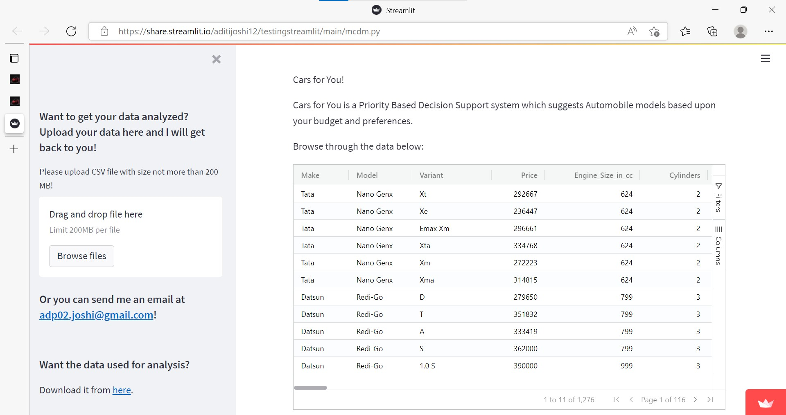
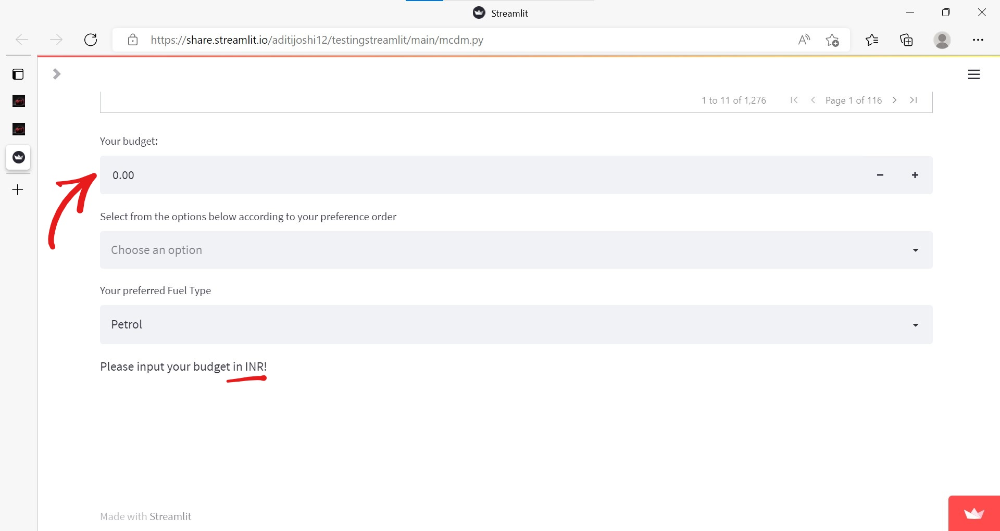

# Aftokinito - Priority Based Decision Support System

## Microsoft Engage 2022 Mentorship Program 🌟🌟

## Table of Contents
- [About](#about)
- [Features](#features)
- [Instructions](#instructions-to-run-this-locally)
- [Points to Remember](#points-to-remember)
- [Structure](#structure-of-the-repository)
- [Useful Links](#useful-links)
- [Future Scope](#future-enhancements)
- [Contact](#contact) 

## About

Data Analysis and Visualization. 

Priority Based Decision Support System using Randomized Multiple Criteria Decision Making.

This is the Challenge 2 : Data Analysis in Automotive Industry of Microsoft Engage 2022 Mentorship Program. 

The Automotive Industry in India is 4th largest as of 2021. In 2022, it became 4th largest in terms of valuation. Let us tap onto the data in Indian Automotive Industry to understand more about the current trends in automobile industry. This project demonstrates how the Automotive Industry could harness data to take informed decisions.

To demonstrate the use of data analytics in identifying most popular car specification combination : Brand, Model, Engine Type, Fuel Type, etc.

Data Analysis and Visualization:
- Focus on determining the relationship between various automotive industry related parameters.
- Attempting to gather useful information and draw conclusions.

Cars for You!
- Priority Based Decision Support System.
- Recommend Car models depending upon your budget, priorities, and preferred fuel type.
- The algorithm is based on Randomized Multiple Criteria Decision Making.

P.S. Aftokinito is Car in Greek :)

## Features

1. This is the landing/home page. 
 - 
 - 
2. After clicking on the **Analysis** Tab, you are redirected here:
  - 
  - Navigate using side arrows(next/previous)  
3. Click on the ```here``` hyperlink to see a data report of the given dataset
  - 
  - Univariate Analysis of data: 
    - Graphs, unique values for categorical data, data statistics for numerical data: 
    - Bivariate Analysis: 
4. Priority Based Decision Support System  
  - 
  - We can select specific columns which we want to see : 
  - We can filter the data based upon our preference: 
    - For categorical data: 
    - For numerical data: 
  - Input your budget in INR 
  - Input your preference order. Make sure to select all the options in the dropdown.  
  - You can also select your desired Fuel Type and filter accordingly. 
    - Choose 'Any' in case you want to see car models of all fuel types. 
  - You can download the car data in rank sorted order in csv format by clicking on the 'Download Link' button.  


## Instructions to run this locally:
- Clone this repository: ```git clone https://github.com/AditiJoshi12/Aftokinito.git```
- ```cd ./Aftokinito```
- Double click on index.html to go to the landing page.
- If you want to run the Decision Support System: 
- - Download anaconda from [here](https://www.anaconda.com/) and then install pip.
- - Method 1:   
- - ```pip install -r requirements.txt```
  - ```cd streamlit```
  - ```streamlit run app.py```
- - Method 2: 
  - ```git clone https://github.com/AditiJoshi12/testingstreamlit.git```
  - ```cd ./testingstreamlit```
  - ```pip install -r requirements.txt```
  - ```streamlit run mcdm.py```

## Points To Remember

- If the Decision Support System doesn't work, 
  - Refresh by pressing ```Ctrl+R``` or ```F5```
  - Try cleaning cache files. 

- While running the Decision Support System locally, please check if the path given for dataset is appropriate for your local machine. 

## Structure of the Repository

- ```index.html``` is the main file, on clicking which you will be redirected to the application locally.
- ```notebooks``` : ```Data_Cleaning.ipynb```, ```Exploratory_Data_Analysis.ipynb```, ```Data Labelling.ipynb``` contain the data analysis done for this app.
- ```datasets``` contains the data used for the project and also the datasets made after cleaning and preprocessing.
- ```images``` contains images saved while doing Exploratory Data Analysis
- ```frontend``` contains all the files for frontend and also a copy of images. 
- ```streamlit``` contains all the files for Decision Support system. 

### Useful Links

- [Deployed Website](https://aditijoshi12.github.io/Aftokinito/)
- [Demo Link](https://iitgoffice-my.sharepoint.com/:v:/g/personal/j_aditi_iitg_ac_in/EfyRsLjBxAJGhwxbmEzy_7gBkRgEBDkFoE1zhNYix-eUVA?e=mAsuzM)

## Future Enhancements

- Performing Automated Exploratory Data Analysis on the uploaded files.

### Contact

Feel free to contact me on [LinkedIn](https://www.linkedin.com/in/aditi-joshi-18802b203/)
